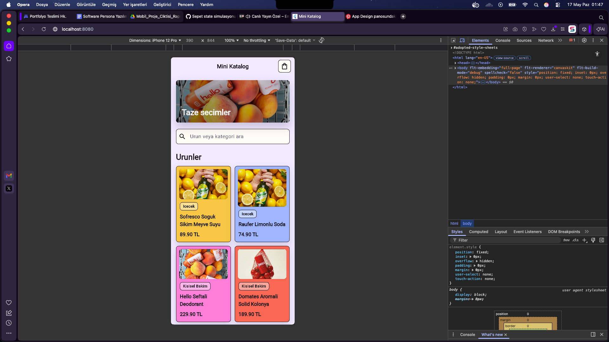
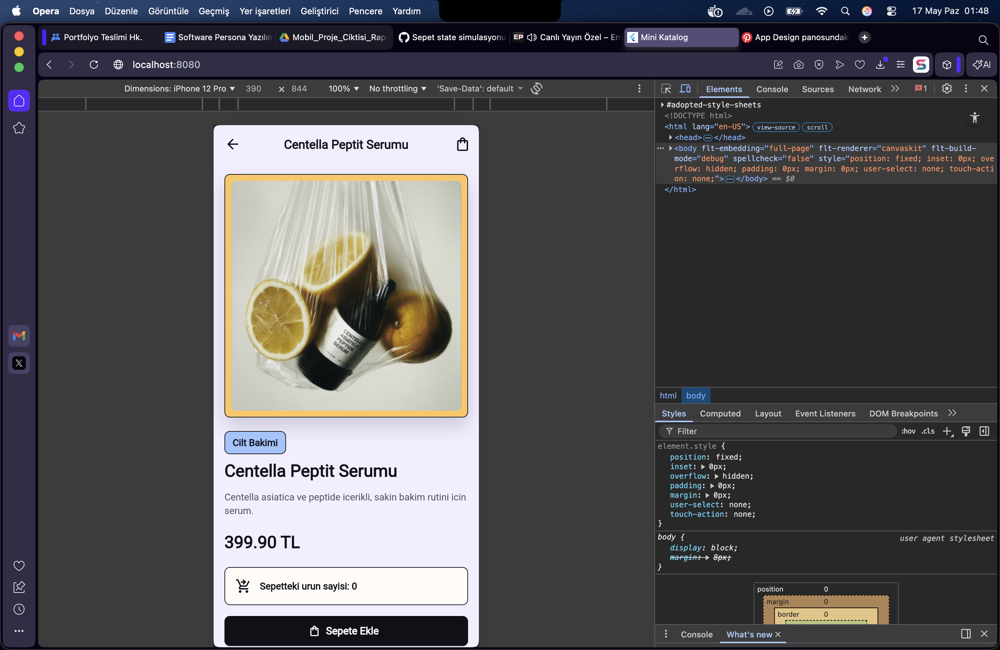

# Mini Katalog Uygulamasi

Flutter ile hazirlanmis, egitim amacli basit bir mini katalog uygulamasidir.
Uygulamada urunler lokal JSON dosyasindan okunur, ana sayfada kart yapisiyla
listelenir, arama/filtreleme yapilabilir ve urun detay sayfasinda basit sepet
state simulasyonu gosterilir.

## Ozellikler

- Ana sayfa ve urun listeleme ekrani
- GridView tabanli urun kartlari
- Urun detay sayfasi
- Navigator ile sayfa gecisi
- Route Arguments ile secilen urunu detay sayfasina tasima
- Lokal JSON veri simulasyonu
- Asset gorsel yonetimi
- Urun adi ve kategoriye gore arama/filtreleme
- Sepete ekleme state simulasyonu
- Sade, mobil uyumlu Flutter UI tasarimi

## Kullanilan Teknolojiler

- Flutter 3.41.9
- Dart 3.11.5
- Material Design
- Lokal JSON
- Image.asset

Ekstra paket kullanilmamistir. Proje Flutter'in varsayilan Material yapisi ile
gelistirilmistir.

## Proje Klasor Yapisi

```text
lib/
  main.dart
  app.dart
  models/
    product.dart
  data/
    product_repository.dart
  pages/
    home_page.dart
    product_detail_page.dart
  widgets/
    product_card.dart
  theme/
    app_theme.dart

assets/
  data/
    products.json
  images/

screenshots/
```

## Kurulum

Projeyi bilgisayarina aldiktan sonra proje klasorune gir:

```bash
cd mini_katalog_uygulamasi
```

Bagimliliklari yukle:

```bash
flutter pub get
```

Kod analizini calistir:

```bash
flutter analyze
```

Testleri calistir:

```bash
flutter test
```

Uygulamayi Chrome uzerinde calistir:

```bash
flutter run -d chrome
```

Chrome debug baglantisi sorun cikarirsa web-server ile calistir:

```bash
flutter run -d web-server --web-port 8080
```

Sonra tarayicida ac:

```text
http://localhost:8080
```

## Ekran Goruntuleri

Ana sayfa:



Urun detay sayfasi:



Sepete urun eklenmis hali:


## Veri Kaynagi

Urun verileri lokal olarak tutulur:

```text
assets/data/products.json
```

Her urun icin temel alanlar:

- id
- name
- description
- price
- image
- category

## Not

Bu proje egitim ve demo amaclidir. Gercek e-ticaret altyapisi, odeme sistemi,
kullanici hesabi, stok takibi veya kalici sepet sistemi icermez.
